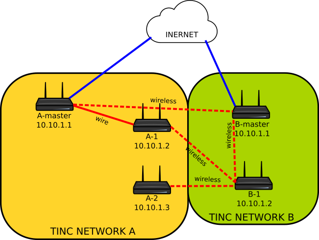

# DotMesh

**Zanim zaczniesz czytać dalej!**

Musisz wiedzieć, że nie jestem z wykształcenia osobą zajmującą się sieciami, ani bezpieczeństwem. Projekt zaś jest w bardzo wczesnej fazie i nie biorę odpowiedzialności za ew. problemy lub uszkodzenia sprzętu.

Chętnie przyjmę pomoc i usłyszę krytykę.

## Początek

Sieć mesh (kratowa/siatkowa) nie jest pojęciem ani nowym, ani innowacyjnym. Zaś na świecie powstało wiele projektów, które skupiają całe społeczności na tworzeniu sieci typu mesh aby zapewnić sobie np. alternatywne połączenia z interenetem:

Przykładowe społeczności:

- https://freifunk.net/
- https://guifi.net/

DotMesh jest jednak projektem w innej warstwie i nie zapewnia połącznia z interenetem ale oczywiście może pozwolić zrealizować takie połączenia o czym później.

Ideą DotMesh jest stworzenie sieci pozwalającej na wykorzystanie już istniejącej infrastruktury.

## Założenia

1. Chcę stworzyć sieć MESH dostępną dla wszystkich
2. Chcę mieć możliwość wykorzystania internetu z innego posiadanego węzła
3. Nie chcę udostępniać swojego internetu innym użytkownikom sieci gdyż mogłoby się to wiązać z problemami prawnymi w razie dokonania przestępstwa

Wyobraź sobie, że chcesz stworzyć ze znajomym wspólną sieć lokalną (sieć pomarańczowa) lecz nie jesteście w stanie połączyć Waszych sieci gdyż dzieli je zbyt duża odległość. Na szczęscie Wasz wspólny sąsiad używa również sieci mesh i dzięki temu możecie połączyć się poprzez jego sieć (kolor zielony).
Sieć mesh jest więc siecią zapewniającą infrastrukturę transportującą dane.

Aby połączyć węzły z sieci mesh w grupy używany jest TINC czyli rozproszony VPN.
Jak widać na powyższym rysunku urządzenia typu "master" odpowiadają za uzyskanie połączenia z internetem i to one posiadają serwer DHCP. Pozostałe urządzenia mają przypisany adres IP na stałę.

Wszystkie urządzenia w jednej sieci TINC rozgłaszają jedną sieć WiFi o takim samym ssid (hasło również musi się zgadzać). Przy tak skonfigurowanej sieci i włączonym roamingu możesz posiadać w domu wiele punktów dostępowych, a adress IP np. Twojego telefonu będzie zawsze taki sam bez względu na to czy łączysz się bezpośrednio z masterem czy innym routerem. 

## Technologie

Podczas powstawania projektu musiałem się zdecydować na pewne technologie i niektóre z nich (ale nie wszystkie) są obowiązkowe aby połączyć się z siecią DotMesh.

### Urządzenie

Cały projekt powstaje na: TP-LINK WDR4300 lecz na innych urządzeniach wspieranych przez OpenWRT powinien również działać. Konfiguracja takiego urządznia może wyglądać nieco inaczej.

### OpenWrt

Użyłem oprogramowania OpenWRT. A konfiguracja odbywa się przez odpowieni skrypt lub ręcznie. Mam nadzieję, że projekt będzie posiadał swoją kompilację w przyszłości.

### Batman-adv

_Node: Dopisać opis_

Batman-adv to projekt, który zapewnia tworzenie sieci mesh w warstwie 2. Oznacza to tyle, że działa jak duży switch.

### BMX7

_Node: Dopisać opis_

BMX7 w odróżnieniu od Batman-adv działa na warstwie 3.

### Tinc

_Node: Dopisać opis_

## Skrypt konfiguracyjny

Uwaga! Srypt nie jest jeszcze w pełni sprawny.

[Skrypt](../dotmesh.sh) - jest to skrypt, który jako zadanie ma zainstalować wszystkie potrzebne pakiety i dołączyć router do sieci MESH

Konfiguacje tinc oraz WAN:

1. [Skrypt](../local_master.sh) - jeśli ten router ma odpowiadać za połączenie z internetem
2. [Skrypt](../local_slave.sh) - jeśli ten router ma dołączyć do istniejącej sieci

## Konfiguracja krok po kroku

[Konfiguracja](CONFIGURATION.md)
