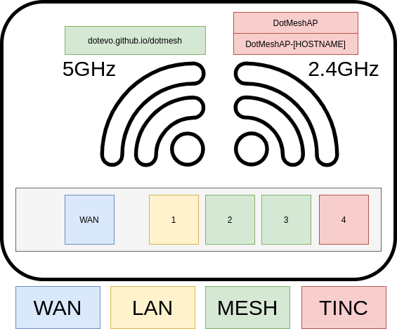

# Konfiguracja

## Krok 1. Instalacja OpenWrt

1. Jeśli nigdy wcześnie nie używałeś OpenWRT to zaczęcam do przeczytania oficjalnych instrukcji o tym jak zainstalować go na swoim urządzeniu.

2. Jeśli już posiadasz na urządzeniu OpenWRT to użyj tego obrazu i wgraj go zgodnie z oficjalnymi instrukcjami:
   https://dl.eko.one.pl/openwrt-19.07/targets/ath79/generic/openwrt-19.07-snapshot-r10949-c56ed72d2b-ath79-generic-tplink_tl-wdr4300-v1-squashfs-sysupgrade.bin

3. Spróbuj się połączyć z routerem pod adresem http://192.168.1.1

## Krok 2. Dodatkowa przestrzeń

Projekt prawdopodobnie zmieściłby się na routerze gdyby był odpowiednio skompilowany. Nie jest to jednak aktualnie priorytet więc używam dodatkowej przestrzeni podpinając starego pendrive (128MB) do USB. Ma to 2 zalety. Po pierwsze jest sporo dodatkowego miejsca. Po drugie dodatkowa przestrzeń działa jako overlay, więc w razie błędnej konfiguracji po wypięciu pendriva dostanę niezmienioną konfigurację. Mogę wtedy sformatować pendriva i zacząć wszystko od początku.

1. Pendrive powinien być sformatowany jakimś sensownym systemem plików (np. ext4)

   _Dodać opis do GPARTED_

2. Wepnij pendrive do USB

3. System -> Punkty montowania -> Punkty montowania
   Dodaj podpiętego pendrive jako /overlay

4. Zrestartuj router i jeśli wszytsko zrobiłeś dobrze to powinieneś zobaczyć dodatkową przestrzeń

## Alternatywna droga

Jeśli jesteś lenwiwy i nie chcesz wiedzieć co i dlaczego zostało zmienione przejdź do [szybkiej instrukcji](QUICK-WDR4300.md).

## Krok 3. Konfiguracja portów

**Uwaga! Zanim zresetujesz router i zastosujesz konfigurację przejdź do ostatniego kroku**


Część portów w routerze pracuje jako zwykły LAN z dostępem do WAN, a część portów jako MESH. Dzięki temu można spiąć ze sobą routery przewodowo.
Jeśli chodzi o część bezprzewodową to komunikacja MESH odbywa się na 5GHz zaś komunikacja LAN na 2,4GHz.

Jeśli chodzi o VLAN to zastosowana konfiguracja jest następująca:

```
eth0.1 -> WAN
eth0.2 -> LAN
eth0.3 -> MESH
```

Takiej konfiguracji portów można dokonać z poziomu LUCI lub w pliku /etc/config/network

### Switch

```config
config switch
	option name 'switch0'
	option reset '1'
	option enable_vlan '1'

config switch_vlan
	option device 'switch0'
	option vlan '1'
	option ports '1 0t'
	option vid '1'

config switch_vlan
	option device 'switch0'
	option vlan '2'
	option ports '3 2 0t'
	option vid '2'

config switch_vlan
	option device 'switch0'
	option vlan '3'
	option ports '5 4 0'
	option vid '3'
```

### LAN

Gdy porty są już skonfigurowane należy ustawić odpowiednio sieć LAN, zamiast XX np. 1:

```
config interface 'lan'
	option type 'bridge'
	option proto 'static'
	option ipaddr '10.10.XX.1' # XX powinny być unikalne w lokalnej sieci
	option netmask '255.255.255.0'
	option ip6assign '60'
	option ifname 'eth0.2'
```

### WAN

Skonfiguruj sieć WAN aby działała na odpowiednim VLAN:

```
config interface 'wan'
	option ifname 'eth0.1'
	option proto 'dhcp'

config interface 'wan6'
	option proto 'dhcpv6'
	option ifname 'eth0.1'
	option reqaddress 'try'
	option reqprefix 'auto'
```

Teraz możesz zresetować serwis:

```
service network reload
```

Oraz prawdopodobnie zalogować się ponownie na router, który będzie mieć już inny adres IP

### WIFI

```
config wifi-iface 'local_radio0'
        option device 'radio0'
        option network 'lan'
        option mode 'ap'
        option key 'HASLOHASLO'
        option ssid 'DotMesh'
        option encryption 'psk2'
```

## Krok 4. Instalacja i konfiguracja batman-adv

### Instalacja

```
opkg update
opkg remove wpad-basic
opkg install batctl-full kmod-batman-adv wpad-mesh-openssl
```

### Ustawienia Batman

Następnie aktywujemy interface bat0 oraz tworzymy interface dla eth0.3

/etc/config/network

```
config interface 'bat0'
	option proto 'batadv'
	option routing_algo 'BATMAN_IV'
	option aggregated_ogms '1'
	option ap_isolation '0'
	option bonding '0'
	option fragmentation '1'
	option gw_mode 'off'
	option log_level '0'
	option orig_interval '1000'
	option bridge_loop_avoidance '1'
	option distributed_arp_table '1'
	option multicast_mode '1'
	option network_coding '0'
	option hop_penalty '30'
	option isolation_mark '0x00000000/0x00000000'

config interface 'nwi_mesh0_eth0'
	option proto 'batadv_hardif'
	option master 'bat0'
	option mtu '2304'
	option ifname 'eth0.3'
	option elp_interval '500'

```

### Ustawienia dla Wifi

Dodajemy interface dla wifi do sieci:

/etc/config/network

```
config interface 'nwi_mesh0'
	option mtu '2304'
	option proto 'batadv_hardif'
	option master 'bat0'
```

Oraz konfigurujemy sieć:

/etc/config/wireless

```
config wifi-iface 'mesh0'
	option device 'radio1'
	option ifname 'mesh0'
	option network 'nwi_mesh0'
	option mode 'mesh'
	option mesh_fwding '0'
	option mesh_id 'dotevo.github.io/dotmesh'
	option encryption 'psk2+ccmp'
	option key 'meshmesh'
```

### Sprawdzenie działania

Jeśli wszystko działa poprawnie to po restarcie sieci powinniśmy mieć aktywowane interfejsy dla bat0:

```
root@slave1:~# batctl if
eth0.3: active
mesh0: active
```

A jeśli twój router jest w pobliżu innego skonfigurowanego w ten sam sposób to powinien istnieć jakiś sąsiad:

```
root@slave1:~# batctl n
[B.A.T.M.A.N. adv openwrt-2019.2-5, MainIF/MAC: eth0.3/e8:94:f6:d4:58:7a (bat0/22:93:be:e5:89:48 BATMAN_IV)]
IF             Neighbor              last-seen
        mesh0	  10:fe:ed:e6:28:50    0.400s
```

### Problemy

1. Nie tworzy sieci "dotevo.github.io/dotmesh"

Upewnij się, że radio1 jest włączone.

## Krok 5. Instalacja i konfiguracja BMX7

```
opkg install bmx7 bmx7-iwinfo bmx7-json bmx7-topology bmx7-uci-config luci-app-bmx7 luci-i18n-bmx7-pl
```

### Dodawanie interfejsu BAT0

/etc/config/bmx7

```
config 'bmx7' 'general'

config 'plugin'
        option 'plugin' 'bmx7_json.so'


config 'plugin'
        option 'plugin' 'bmx7_iwinfo.so'


config 'dev' 'mesh'
        option 'dev' 'bat0'
```

```
service bmx7 restart
```

### Sprawdzenie działania

```
root@slave1:~# /usr/sbin/bmx7 -c show=status show=interfaces
STATUS:
shortId  name   nodeKey cv revision primaryIp                              tun6Address tun4Address uptime     cpu txQ  nbs rts nodes
5B644F67 slave1 RSA2048 21 cc245a2  fd70:5b64:4f67:a52a:ff34:f1ab:e51:19a5 ---         ---         0:00:01:15 0.3 0/50 1   1   2/2
INTERFACES:
dev  state linkKey    linkKeys          type     channel rateMax idx localIp                      rts helloSqn rxBpP   txBpP
bat0 UP    DH2048M112 RSA896,DH2048M112 ethernet 0       1000M   1   fe80::2093:beff:fee5:8948/64 1   51197    135/1.3 135/1.3
```

```
root@slave1:~# /usr/sbin/bmx7 -c show=originators
ORIGINATORS:
shortId  name   as S s T t descSqn lastDesc descSize cv revision primaryIp                               dev  nbShortId nbName metric hops ogmSqn lastRef
9B509900 master nA A A A A 2044    139      705+749  21 cc245a2  fd70:9b50:9900:8d6b:1581:20c9:f9f6:76c8 bat0 9B509900  master 999M   1    217    0
5B644F67 slave1 nQ A A A A 112     140      575+687  21 cc245a2  fd70:5b64:4f67:a52a:ff34:f1ab:e51:19a5  ---  ---       ---    257G   0    24     1
```

```
root@slave1:~# ping fd70:9b50:9900:8d6b:1581:20c9:f9f6:76c8 -c1
PING fd70:9b50:9900:8d6b:1581:20c9:f9f6:76c8 (fd70:9b50:9900:8d6b:1581:20c9:f9f6:76c8): 56 data bytes
64 bytes from fd70:9b50:9900:8d6b:1581:20c9:f9f6:76c8: seq=0 ttl=64 time=1.671 ms

--- fd70:9b50:9900:8d6b:1581:20c9:f9f6:76c8 ping statistics ---
1 packets transmitted, 1 packets received, 0% packet loss
round-trip min/avg/max = 1.671/1.671/1.671 ms
```

## Kolejne kroki

### Łączenie sieci w jedną

[Konfiguracja Tinc](TINC.md)

### Łączenie z siecią przez OpenVPN

[Konfiguracja OpenVPN](OpenVPN.md)
